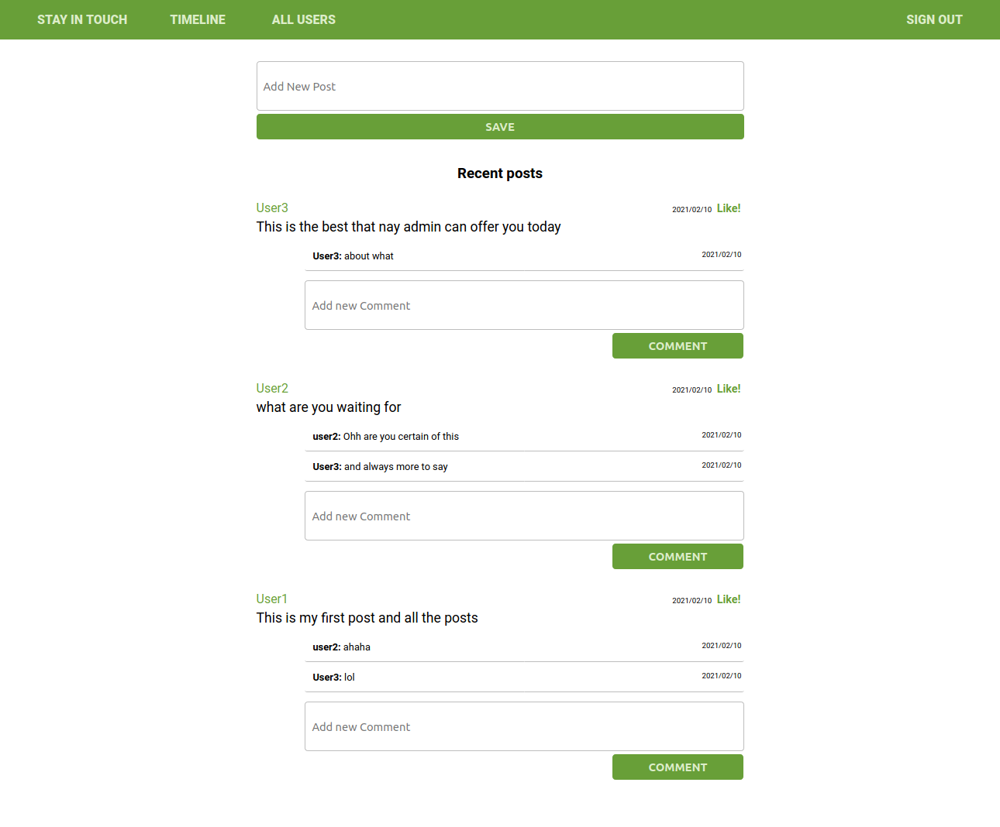

# Scaffold for social media app with Ruby on Rails

> This is a small scale social media platform.
- Users can register and Log in
- User can send friend requests to other users.
- User can accept or decline friend requests from other users
- Logged in user can make posts
- Logged in user can also make comments
- Logged in user can like/dislike posts and comments of friends


## Live Demo
[LIVE LINK]()


-
.png)

## Getting Started

To get a local copy up and running follow these simple example steps.

### Prerequisites

Ruby: 2.6.3
Rails: 5.2.3
Postgres: >=9.5

### Setup

Install gems with:

```
bundle install
```

Setup database with:

```
   rails db:create
   rails db:migrate
```

### Usage

Start server with:

```
    rails server
```

Open `http://localhost:3000/` in your browser.

### Run tests

```
    rpsec --format documentation
```

> Tests will be added by Microverse students. There are no tests for initial features in order to make sure that students write all tests from scratch.

## Authors

👤 **Misori Simon**

- GitHub: [@Misori-simon](https://github.com/Misori-simon)
- Twitter: [@Misori-simon](https://github.com/misori_simon)
- LinkedIn: [LinkedIn](https://www.linkedin.com/in/misori-simon-05906219b/)

## 🤝 Contributing

Contributions, issues and feature requests are welcome!

Feel free to check the [issues page](issues/).

## Show your support

Give a ⭐️ if you like this project!

## Acknowledgments
Credits go to The Odin Project for providing essential guidance and an opportunity to build this amazing project
- [The Odin Project](https://theodinproject.com/)

## 📝 License

Rails guides
- [Rails Guides](https://guides.rubyonrails.org/)
